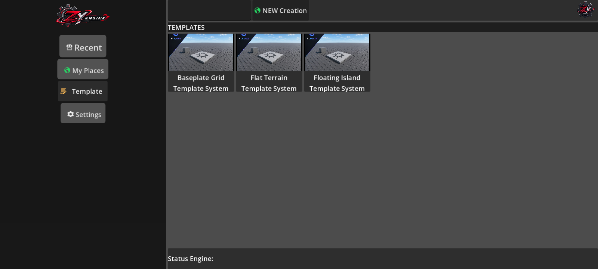
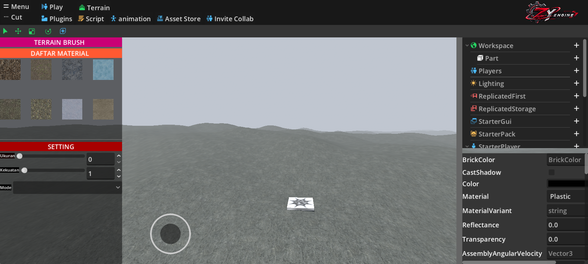

# Studio Lite

Studio Lite adalah aplikasi Android untuk membuat dan mengedit map secara lokal.

Project ini dikembangkan oleh **Studio ZY** dan masih dalam tahap pengembangan.

## Screenshots

   
  <em>Menu</em>

   
  <em>Editor</em>

## Features

- Map editor
- Terrain editor
- Terrain Brush
- Script Editor
- Luau Runtime
- Local project editing
- Import dan export project
- Android ARM64 support
- Offline map editing

## Requirements

- Android 8.0 atau lebih baru
- ARM64
- RAM minimal 2 GB

## Latest Version

**v0.0.1**

Versi ini merupakan versi awal untuk pengujian publik.

## Download

Download APK terbaru melalui halaman [GitHub Releases](../../releases).

## Version History

| Version | Status          |
|---------|-----------------|
| v0.0.1  | Initial Release |

Untuk melihat perubahan setiap versi, lihat [CHANGELOG.md](CHANGELOG.md).

## Development

Studio Lite sedang dalam pengembangan aktif.

Fitur, tampilan, sistem terrain, scripting, dan performa dapat berubah pada versi berikutnya.

## Developer

**Studio ZY**

- Developer: `Mzyy_Studio`
- Support: `SYGKMUNII`

## License

Project ini menggunakan lisensi yang tercantum pada file [LICENSE](LICENSE).

